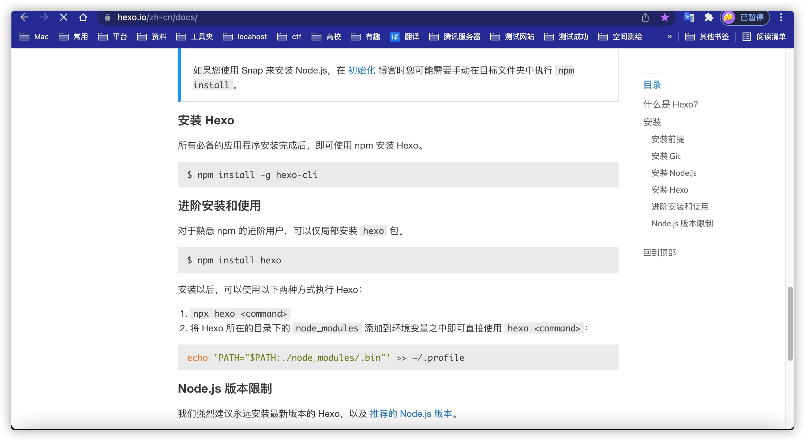
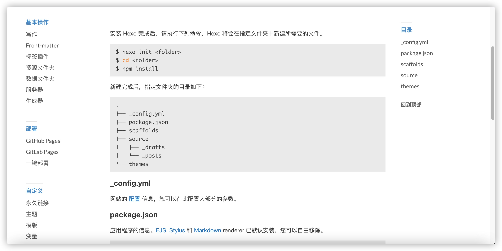
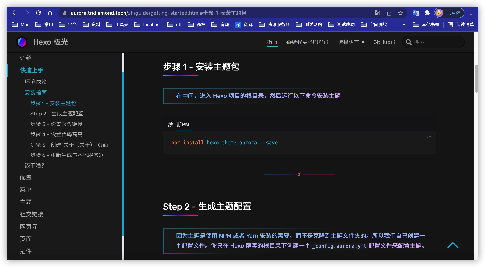
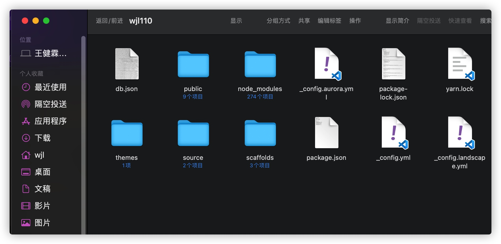
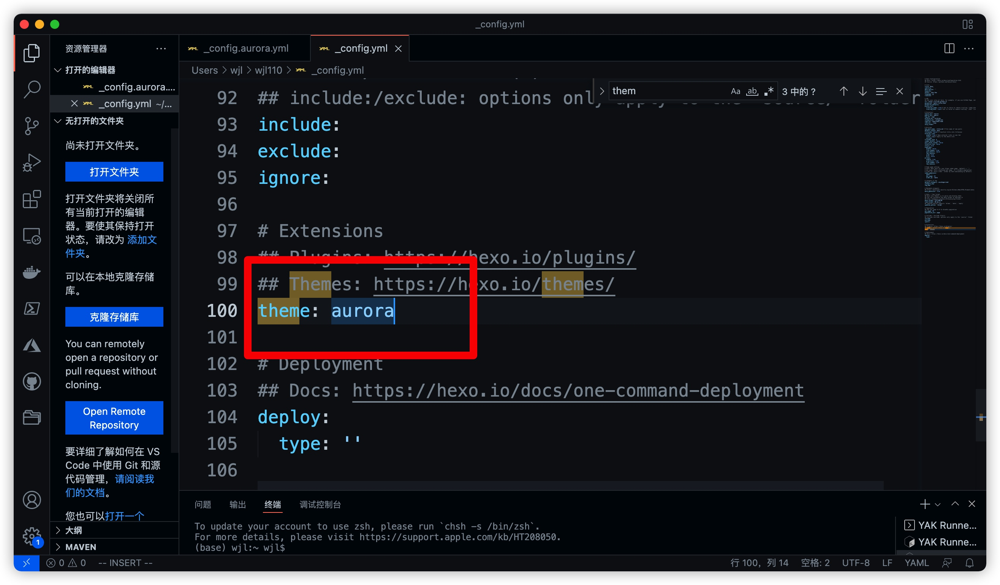
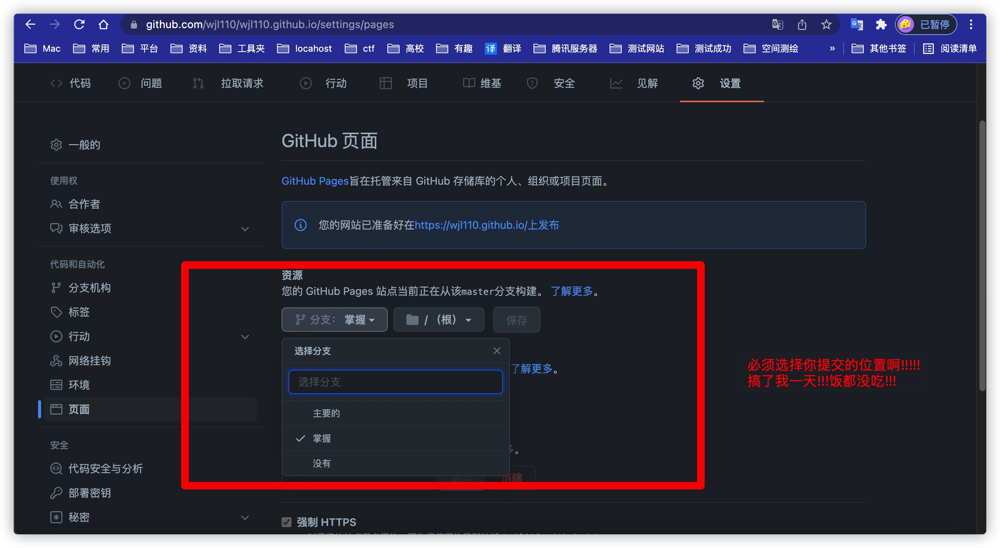

# HEXO个人博客实战指南
### [官网文档按照其他配置基础文件](https://hexo.io/zh-cn/docs/setup)

### 选择自己的主题:我选择的是极光主题

[进入官方文档](https://aurora.tridiamond.tech/zh/guide/getting-started.html#%E6%AD%A5%E9%AA%A4-1-%E5%AE%89%E8%A3%85%E4%B8%BB%E9%A2%98%E5%8C%85)
### 生成的文件主题和配置

**config配置文件中需要修改**(其他代码高亮、url等)

**启动系统即可**
    
    hexo clean & hexo g & hexo server

    
    hexo clean#清理一下

    hexo g#生成静态文件

    hexo deploy#部署到Github
    

## 这个问题卡了我一天,饭都没吃,有些教程里没有说明,因为现在的提交默认master而创建存储库是main

生成静态
# 提交三部曲命令行
    
    cd hexo
    hexo g 
    hexo d 

### 下载的主题文件config设置的master GitHub设置里展示页面也为master
### github_main 为下载文件,master为hexo部署的静态文件

每次要做的就是去hexo文件夹使用hexo命令发布静态文件到GitHub

或者打开主题文件去编辑,新建blogs

for u ...