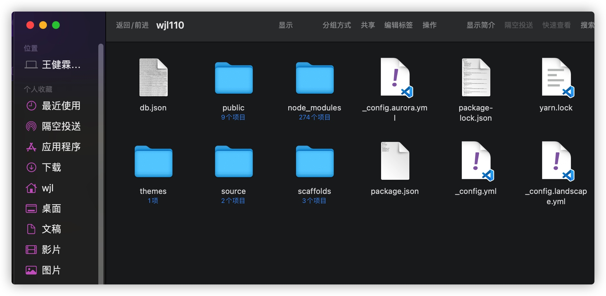

# HEXO个人博客实战指南
**命令汇总**
### 本地测试: 
```javascript
cd Desktop/wjl110.xyz
hexo cl & hexo g & hexo -p 54321 server
```
### 发布github:
```javascript
hexo cl & hexo g & hexo d
```
### 文章标题模版:(位置/Users/wjl/Desktop/wjl110.xyz/source/_posts)标签/分类

```javascript
---
title: Markdown学习指北
date: 2022-03-12 13:38:01
tags:
  - 学习笔记
  - markdown
categories:
  - 技术
  - 笔记
feature: true
---
```
### [官网文档按照其他配置基础文件](https://hexo.io/zh-cn/docs/setup)


### 选择自己的主题:我选择的是极光主题

[进入官方文档](https://aurora.tridiamond.tech/zh/guide/getting-started.html#%E6%AD%A5%E9%AA%A4-1-%E5%AE%89%E8%A3%85%E4%B8%BB%E9%A2%98%E5%8C%85)


### 生成的文件主题和配置

**config配置文件中需要修改**(其他代码高亮、url等)


**启动系统即可**
```javascript
hexo clean & hexo g & hexo server
```


```javascript  
  
hexo clean#清理一下

hexo g#生成静态文件

hexo deploy#部署到Github
``` 


## 这个问题卡了我一天,有些教程里没有说明,因为现在的提交默认master而创建存储库是main
:::warning
Warning!!!

:::

生成静态
# 提交三部曲命令行

```javascript    
cd hexo
hexo g & hexo s & hexo d
```


### 下载的主题文件config设置的master GitHub设置里展示页面也为master
### github_main 为下载文件,master为hexo部署的静态文件

每次要做的就是去hexo文件夹使用hexo命令发布静态文件到GitHub

或者打开主题文件去编辑,新建blogs

## 本地相对路径

图片除了可以放在统一的 images 文件夹中，还可以放在文章自己的目录中，文章的目录可以通过配置 _config.yml 来生成。配置如下：
```javascript
    post_asset_folder: true
```
:::warning
将 _config.yml 文件中的配置项 post_asset_folder 设为 true 后，执行命令 $ hexo new post_name，在 source/_posts 中会生成文章 post_name.md 和同名文件夹 post_name 。将图片资源放在 post_name 中，文章就可以使用相对路径引用图片资源了。
:::


~~~~
#### 报个bug:
1.切换新建的板块栏目会无反应必须要切到默认前三个标签再返回才ok
2.文章分类类别栏目分类错乱,当文章内的分类数目大于3个时会发生分类重复
3.在about标签刷新会404
4.看板娘置后
5.bot无法设置live2或者设置错误


#### For U ...ヽ(✿ﾟ▽ﾟ)ノ
